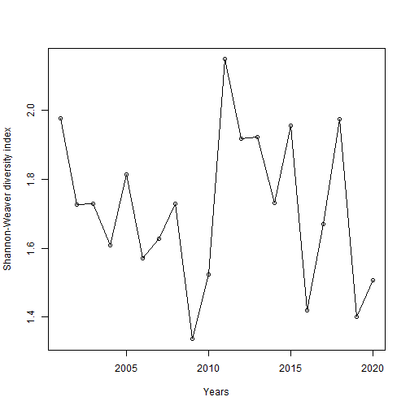
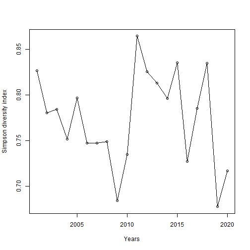
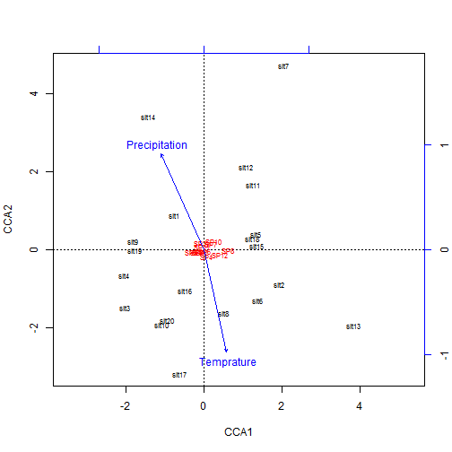
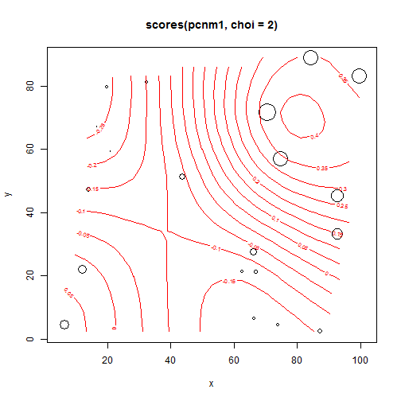
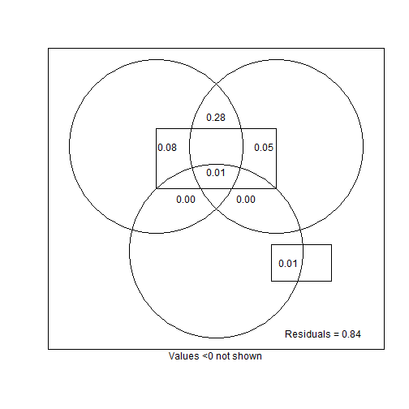
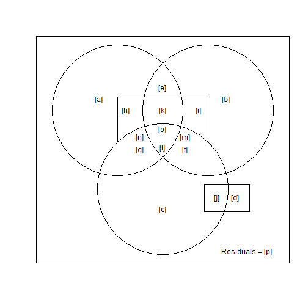

长期生物多样性数据分析实例
========================================================
沈国春  2013年7月


```r
library(vegan)
```

```
## Loading required package: permute
```

```
## This is vegan 2.0-7
```

## 步骤1：导入和图形化数据：

```r
# 读取csv文件中的数据
spdata = read.csv("spatial data.csv", header = TRUE)

# 查看文件结构
str(spdata)
```

```
## 'data.frame':	20 obs. of  16 variables:
##  $ SP1          : num  20.01 4.55 13.52 21.56 11.07 ...
##  $ SP2          : num  3.13 1.53 2.35 1.8 1.91 0.57 2.42 2.43 2.48 0.67 ...
##  $ SP3          : num  15.51 1.56 6.36 8.72 0.27 ...
##  $ SP4          : num  0 0 0.33 0 0.29 0 0.34 0.23 0.18 0.34 ...
##  $ SP5          : num  11.2 0 10.1 13.3 0 ...
##  $ SP6          : num  2.95 0 3.55 0 0 2.93 0 0 3.78 0 ...
##  $ SP7          : num  2.16 1.86 0 2.36 3.28 0 0 2.78 0 3 ...
##  $ SP8          : num  0 0 0 0 6.91 ...
##  $ SP9          : num  1.94 0 1.92 3.5 3.03 0 2.07 3.3 0 0 ...
##  $ SP10         : num  3.47 2.08 0 0 2.28 0 2.41 0 0 0 ...
##  $ SP11         : num  3.09 2.07 2.31 3.81 2.91 2.4 0 2.48 0 0 ...
##  $ SP12         : num  7.38 8.2 0 0 0 8.95 6.67 6.71 0 4.94 ...
##  $ Temprature   : num  0.08 2.75 1.64 1.55 1.7 1.99 1.9 0.61 1.39 2.66 ...
##  $ Precipitation: num  559.5 54.3 303.8 333.9 237.9 ...
##  $ x            : num  6.53 16.66 66.16 70.67 73.92 ...
##  $ y            : num  4.43 67.08 27.63 71.71 4.39 ...
```


## 步骤2：计算生物多样性指数，查看生物多样性空间分布情况

```r
# 计算alpha多样性
richness = apply(spdata[, 1:12], 1, function(x) sum(x != 0))
plot(x = spdata$x, y = spdata$y, col = as.factor(richness), xlab = "x", ylab = "y", 
    pch = 15, cex = 4)
```

 

```r

# 计算beta多样性

# 先来查看一下有多少beta多样性的定义可以计算
betadiver(help = TRUE)
```

```
## 1 "w" = (b+c)/(2*a+b+c)
## 2 "-1" = (b+c)/(2*a+b+c)
## 3 "c" = (b+c)/2
## 4 "wb" = b+c
## 5 "r" = 2*b*c/((a+b+c)^2-2*b*c)
## 6 "I" = log(2*a+b+c)-2*a*log(2)/(2*a+b+c)-((a+b)*log(a+b)+(a+c)*log(a+c))/(2*a+b+c)
## 7 "e" = exp(log(2*a+b+c)-2*a*log(2)/(2*a+b+c)-((a+b)*log(a+b)+(a+c)*log(a+c))/(2*a+b+c))-1
## 8 "t" = (b+c)/(2*a+b+c)
## 9 "me" = (b+c)/(2*a+b+c)
## 10 "j" = a/(a+b+c)
## 11 "sor" = 2*a/(2*a+b+c)
## 12 "m" = (2*a+b+c)*(b+c)/(a+b+c)
## 13 "-2" = pmin(b,c)/(pmax(b,c)+a)
## 14 "co" = (a*c+a*b+2*b*c)/(2*(a+b)*(a+c))
## 15 "cc" = (b+c)/(a+b+c)
## 16 "g" = (b+c)/(a+b+c)
## 17 "-3" = pmin(b,c)/(a+b+c)
## 18 "l" = (b+c)/2
## 19 "19" = 2*(b*c+1)/((a+b+c)^2+(a+b+c))
## 20 "hk" = (b+c)/(2*a+b+c)
## 21 "rlb" = a/(a+c)
## 22 "sim" = pmin(b,c)/(pmin(b,c)+a)
## 23 "gl" = 2*abs(b-c)/(2*a+b+c)
## 24 "z" = (log(2)-log(2*a+b+c)+log(a+b+c))/log(2)
```

```r
betadiv = betadiver(spdata[, 1:12], method = "w")

# 计算样方间的空间距离也就非常简单
plotdist = dist(spdata[, c(15:16)])

# 查看样方间beta多样性与样方间空间距离的关系
plot(x = plotdist, y = betadiv, ylab = "Beta diversity", xlab = "Spatial distances among plots")
```

 


## 步骤3：统计检验beta多样性是否会随着空间距离增加而减弱

```r
# 采用最简单的线性回归
summary(lm(betadiv ~ plotdist))
```

```
## 
## Call:
## lm(formula = betadiv ~ plotdist)
## 
## Residuals:
##     Min      1Q  Median      3Q     Max 
## -0.2242 -0.0791 -0.0131  0.0784  0.2979 
## 
## Coefficients:
##             Estimate Std. Error t value Pr(>|t|)    
## (Intercept) 0.256014   0.018835   13.59   <2e-16 ***
## plotdist    0.000564   0.000312    1.81    0.072 .  
## ---
## Signif. codes:  0 '***' 0.001 '**' 0.01 '*' 0.05 '.' 0.1 ' ' 1
## 
## Residual standard error: 0.106 on 188 degrees of freedom
## Multiple R-squared:  0.0171,	Adjusted R-squared:  0.0119 
## F-statistic: 3.27 on 1 and 188 DF,  p-value: 0.0722
```

```r

# 或者采用Mantel检验，已防止beta多样性的空间自相关对分析带来的干扰
mantel(betadiv, plotdist)
```

```
## 
## Mantel statistic based on Pearson's product-moment correlation 
## 
## Call:
## mantel(xdis = betadiv, ydis = plotdist) 
## 
## Mantel statistic r: 0.131 
##       Significance: 0.055 
## 
## Upper quantiles of permutations (null model):
##   90%   95% 97.5%   99% 
## 0.111 0.134 0.169 0.209 
## 
## Based on 999 permutations
```


## 步骤4：分析环境的变化是否影响了群落间多样性的变化

```r
# 可以进行canonical correspondence analysis (CCA)
re_cca = cca(spdata[1:12], spdata[13:14])
plot(re_cca)
```

 


## 步骤5：分解环境因数和其他空间因数（如扩散限制）对群落多样性的影响

```r
# 如可进行Principal Coordinates of Neighborhood Analysis (PCNM)
pcnm1 = pcnm(plotdist)

# 查看PCNM分解结果
ordisurf(spdata[, 15:16], scores(pcnm1, choi = 2), bubble = 4)
```

```
## Loading required package: mgcv
```

```
## This is mgcv 1.7-22. For overview type 'help("mgcv-package")'.
```

```
## Warning: the matrix is either rank-deficient or indefinite
```

```
## Warning: the matrix is either rank-deficient or indefinite
```

 

```
## 
## Family: gaussian 
## Link function: identity 
## 
## Formula:
## y ~ s(x1, x2, k = knots)
## <environment: 0x0000000009048d10>
## 
## Estimated degrees of freedom:
## 8.41  total = 9.41 
## 
## GCV score: 0.003401
```

```r

# 将PCNM分解结果加入到RDA分析中
rda_data = cbind(richness, spdata[13:14], scores(pcnm1))
mm = model.matrix(richness ~ PCNM1 + PCNM2, data = rda_data)
pcnm_rda = rda(mm)
re_vp = varpart(richness, ~Temprature, ~Precipitation, ~PCNM1, ~PCNM2, data = rda_data)
plot(re_vp)
```

 

```r
re_vp
```

```
## 
## Partition of variation in RDA
## 
## Call: varpart(Y = richness, X = ~Temprature, ~Precipitation,
## ~PCNM1, ~PCNM2, data = rda_data)
## 
## Explanatory tables:
## X1:  ~Temprature
## X2:  ~Precipitation
## X3:  ~PCNM1
## X4:  ~PCNM2 
## 
## No. of explanatory tables: 4 
## Total variation (SS): 45.8 
##             Variance: 2.4105 
## No. of observations: 20 
## 
## Partition table:
##                             Df R.square Adj.R.square Testable
## [aeghklno] = X1              1  0.24808      0.20631     TRUE
## [befiklmo] = X2              1  0.20225      0.15793     TRUE
## [cfgjlmno] = X3              1  0.00293     -0.05246     TRUE
## [dhijkmno] = X4              1  0.05108     -0.00164     TRUE
## [abefghiklmno] = X1+X2       2  0.29270      0.20949     TRUE
## [acefghjklmno] = X1+X3       2  0.24808      0.15962     TRUE
## [adeghijklmno] = X1+X4       2  0.33086      0.25214     TRUE
## [bcefgijklmno] = X2+X3       2  0.20327      0.10953     TRUE
## [bdefhijklmno] = X2+X4       2  0.31041      0.22928     TRUE
## [cdfghijklmno] = X3+X4       2  0.05401     -0.05728     TRUE
## [abcefghijklmno] = X1+X2+X3  3  0.29784      0.16619     TRUE
## [abdefghijklmno] = X1+X2+X4  3  0.33656      0.21216     TRUE
## [acdefghijklmno] = X1+X3+X4  3  0.33089      0.20543     TRUE
## [bcdefghijklmno] = X2+X3+X4  3  0.31122      0.18207     TRUE
## [abcdefghijklmno] = All      4  0.33773      0.16113     TRUE
## Individual fractions                                         
## [a] = X1 | X2+X3+X4          1              -0.02094     TRUE
## [b] = X2 | X1+X3+X4          1              -0.04430     TRUE
## [c] = X3 | X1+X2+X4          1              -0.05103     TRUE
## [d] = X4 | X1+X2+X3          1              -0.00506     TRUE
## [e]                          0               0.28365    FALSE
## [f]                          0               0.00432    FALSE
## [g]                          0               0.00382    FALSE
## [h]                          0               0.07760    FALSE
## [i]                          0               0.05086    FALSE
## [j]                          0               0.00773    FALSE
## [k]                          0              -0.12822    FALSE
## [l]                          0              -0.01275    FALSE
## [m]                          0              -0.00770    FALSE
## [n]                          0              -0.00891    FALSE
## [o]                          0               0.01207    FALSE
## [p] = Residuals              0               0.83887    FALSE
## Controlling 2 tables X                                       
## [ae] = X1 | X3+X4            1               0.26271     TRUE
## [ag] = X1 | X2+X4            1              -0.01712     TRUE
## [ah] = X1 | X2+X3            1               0.05665     TRUE
## [be] = X2 | X3+X4            1               0.23936     TRUE
## [bf] = X2 | X1+X4            1              -0.03998     TRUE
## [bi] = X2 | X1+X3            1               0.00657     TRUE
## [cf] = X3 | X1+X4            1              -0.04671     TRUE
## [cg] = X3 | X2+X4            1              -0.04721     TRUE
## [cj] = X3 | X1+X2            1              -0.04330     TRUE
## [dh] = X4 | X2+X3            1               0.07254     TRUE
## [di] = X4 | X1+X3            1               0.04581     TRUE
## [dj] = X4 | X1+X2            1               0.00267     TRUE
## Controlling 1 table X                                        
## [aghn] = X1 | X2             1               0.05156     TRUE
## [aehk] = X1 | X3             1               0.21208     TRUE
## [aegl] = X1 | X4             1               0.25378     TRUE
## [bfim] = X2 | X1             1               0.00318     TRUE
## [beik] = X2 | X3             1               0.16200     TRUE
## [befl] = X2 | X4             1               0.23092     TRUE
## [cfjm] = X3 | X1             1              -0.04669     TRUE
## [cgjn] = X3 | X2             1              -0.04839     TRUE
## [cfgl] = X3 | X4             1              -0.05564     TRUE
## [dijm] = X4 | X1             1               0.04583     TRUE
## [dhjn] = X4 | X2             1               0.07136     TRUE
## [dhik] = X4 | X3             1              -0.00482     TRUE
## ---
## Use function 'rda' to test significance of fractions of interest
```

```r
showvarparts(4)
```

 


