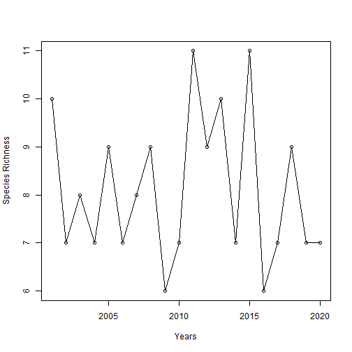
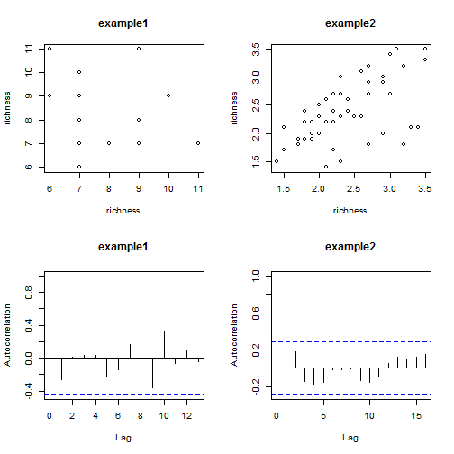

长期生物多样性数据分析实例
========================================================
沈国春  2013年7月


## 步骤1：导入数据.

```r
# 采用read.csv可以方便的导入csv格式数据，当然也可以用其它命令导入Excel数据
tdata = read.csv("time serise data.csv", header = TRUE)

# 查看数据结构
head(tdata)
```

```
##   year   SP1  SP2   SP3  SP4   SP5  SP6  SP7   SP8  SP9 SP10 SP11 SP12
## 1 2001 20.01 3.13 15.51 0.00 11.16 2.95 2.16  0.00 1.94 3.47 3.09 7.38
## 2 2002  4.55 1.53  1.56 0.00  0.00 0.00 1.86  0.00 0.00 2.08 2.07 8.20
## 3 2003 13.52 2.35  6.36 0.33 10.13 3.55 0.00  0.00 1.92 0.00 2.31 0.00
## 4 2004 21.56 1.80  8.72 0.00 13.34 0.00 2.36  0.00 3.50 0.00 3.81 0.00
## 5 2005 11.07 1.91  0.27 0.29  0.00 0.00 3.28  6.91 3.03 2.28 2.91 0.00
## 6 2006 25.19 0.57 10.22 0.00  0.00 2.93 0.00 11.75 0.00 0.00 2.40 8.95
##   Temprature Precipitation
## 1       0.08        559.54
## 2       2.75         54.26
## 3       1.64        303.83
## 4       1.55        333.91
## 5       1.70        237.95
## 6       1.99        158.93
```

```r
str(tdata)
```

```
## 'data.frame':	20 obs. of  15 variables:
##  $ year         : int  2001 2002 2003 2004 2005 2006 2007 2008 2009 2010 ...
##  $ SP1          : num  20.01 4.55 13.52 21.56 11.07 ...
##  $ SP2          : num  3.13 1.53 2.35 1.8 1.91 0.57 2.42 2.43 2.48 0.67 ...
##  $ SP3          : num  15.51 1.56 6.36 8.72 0.27 ...
##  $ SP4          : num  0 0 0.33 0 0.29 0 0.34 0.23 0.18 0.34 ...
##  $ SP5          : num  11.2 0 10.1 13.3 0 ...
##  $ SP6          : num  2.95 0 3.55 0 0 2.93 0 0 3.78 0 ...
##  $ SP7          : num  2.16 1.86 0 2.36 3.28 0 0 2.78 0 3 ...
##  $ SP8          : num  0 0 0 0 6.91 ...
##  $ SP9          : num  1.94 0 1.92 3.5 3.03 0 2.07 3.3 0 0 ...
##  $ SP10         : num  3.47 2.08 0 0 2.28 0 2.41 0 0 0 ...
##  $ SP11         : num  3.09 2.07 2.31 3.81 2.91 2.4 0 2.48 0 0 ...
##  $ SP12         : num  7.38 8.2 0 0 0 8.95 6.67 6.71 0 4.94 ...
##  $ Temprature   : num  0.08 2.75 1.64 1.55 1.7 1.99 1.9 0.61 1.39 2.66 ...
##  $ Precipitation: num  559.5 54.3 303.8 333.9 237.9 ...
```

```r

# 分离群落数据和环境数据
com = tdata[, c(2:13)]
env = tdata[, c(14:15)]
year = tdata[, 1]

head(com)
```

```
##     SP1  SP2   SP3  SP4   SP5  SP6  SP7   SP8  SP9 SP10 SP11 SP12
## 1 20.01 3.13 15.51 0.00 11.16 2.95 2.16  0.00 1.94 3.47 3.09 7.38
## 2  4.55 1.53  1.56 0.00  0.00 0.00 1.86  0.00 0.00 2.08 2.07 8.20
## 3 13.52 2.35  6.36 0.33 10.13 3.55 0.00  0.00 1.92 0.00 2.31 0.00
## 4 21.56 1.80  8.72 0.00 13.34 0.00 2.36  0.00 3.50 0.00 3.81 0.00
## 5 11.07 1.91  0.27 0.29  0.00 0.00 3.28  6.91 3.03 2.28 2.91 0.00
## 6 25.19 0.57 10.22 0.00  0.00 2.93 0.00 11.75 0.00 0.00 2.40 8.95
```

```r
head(env)
```

```
##   Temprature Precipitation
## 1       0.08        559.54
## 2       2.75         54.26
## 3       1.64        303.83
## 4       1.55        333.91
## 5       1.70        237.95
## 6       1.99        158.93
```


## 步骤2：计算生物多样性指数

```r

## 物种丰富度
richness = apply(tdata[, c(2:13)], 1, function(x) sum(x != 0))
plot(x = year, y = richness, type = "o", xlab = "Years", ylab = "Species Richness")
```

 


当然，我们还可以充分利用__每个物种的多度信息__计算其他多样性指数，如Shannon Weaver和Simpson多样性指数。

```r
library(vegan)

# 计算Shannon Weaver多样性指数
shannon = diversity(com, index = "shannon")
plot(x = year, y = shannon, type = "o", xlab = "Years", ylab = "Shannon-Weaver diversity index")
```

 

```r


# 计算Simpson指数
simpson = diversity(com, index = "simpson")
plot(x = year, y = simpson, type = "o", xlab = "Years", ylab = "Simpson diversity index")
```

 


## 步骤3： 分析物种多样性的时间格局特征--时间序列分析

```r

# 问题一：物种多样性时间前后的上是否存在自相关?
# 有无会影响到后续的时间序列分析
par(mfrow = c(2, 2))
plot(x = richness[-1], y = richness[-length(richness)], xlab = "richness", ylab = "richness", 
    main = "example1")
plot(x = lh[-1], y = lh[-length(lh)], xlab = "richness", ylab = "richness", 
    main = "example2")
acf(ts(richness), main = "example1", ylab = "Autocorrelation")
acf(lh, main = "example2", ylab = "Autocorrelation")
```

 


## 步骤4：分析多样性变化与环境变化的关系

```r
#
# 如果在不考虑时间自相关对统计分析干扰的情况下，我们可以直接采用线性回归方式探索生物多样性与环境变化的相关性
env_rch = lm(richness ~ env$Temprature + env$Precipitation)
env_rch
```

```
## 
## Call:
## lm(formula = richness ~ env$Temprature + env$Precipitation)
## 
## Coefficients:
##       (Intercept)     env$Temprature  env$Precipitation  
##           15.5352            -2.7340            -0.0115
```

```r
# 并且可以马上做模型的检验
summary(env_rch)
```

```
## 
## Call:
## lm(formula = richness ~ env$Temprature + env$Precipitation)
## 
## Residuals:
##    Min     1Q Median     3Q    Max 
## -2.269 -0.820 -0.149  0.912  2.777 
## 
## Coefficients:
##                   Estimate Std. Error t value Pr(>|t|)  
## (Intercept)        15.5352     5.8992    2.63    0.017 *
## env$Temprature     -2.7340     1.8542   -1.47    0.159  
## env$Precipitation  -0.0115     0.0111   -1.04    0.315  
## ---
## Signif. codes:  0 '***' 0.001 '**' 0.01 '*' 0.05 '.' 0.1 ' ' 1
## 
## Residual standard error: 1.38 on 17 degrees of freedom
## Multiple R-squared:  0.293,	Adjusted R-squared:  0.209 
## F-statistic: 3.52 on 2 and 17 DF,  p-value: 0.0527
```


当然，我们也可以很方便的考虑时间自相关，采用时间自相关回归模型，使得我们的分析更加合理

```r
env = env[-1, ]
env_rch2 = lm(richness[-1] ~ env$Temprature + env$Precipitation + richness[-length(richness)])
summary(env_rch2)
```

```
## 
## Call:
## lm(formula = richness[-1] ~ env$Temprature + env$Precipitation + 
##     richness[-length(richness)])
## 
## Residuals:
##    Min     1Q Median     3Q    Max 
## -1.512 -0.984  0.153  0.391  3.132 
## 
## Coefficients:
##                             Estimate Std. Error t value Pr(>|t|)   
## (Intercept)                  24.6214     6.4281    3.83   0.0016 **
## env$Temprature               -4.4469     1.8186   -2.45   0.0273 * 
## env$Precipitation            -0.0224     0.0112   -2.01   0.0631 . 
## richness[-length(richness)]  -0.4329     0.1932   -2.24   0.0406 * 
## ---
## Signif. codes:  0 '***' 0.001 '**' 0.01 '*' 0.05 '.' 0.1 ' ' 1
## 
## Residual standard error: 1.24 on 15 degrees of freedom
## Multiple R-squared:  0.455,	Adjusted R-squared:  0.346 
## F-statistic: 4.17 on 3 and 15 DF,  p-value: 0.0247
```

